# Arashi Reservations

**MVP - Minimum Viable Product**

- Front-End Application to be built with React
- Back-End Application to be built with Express and Node
- MongoDB to be used as the Database Management System
- Implementation of JSON Web Token (JWT) Authentication to Sign Up, Sign In and Sign Out users
- Authorization of Users for back-end and front-end. Guest users that are not signed in should not be able to perform any CRUD functionality
- Full CRUD functionality on both back-end and front-end
- No secret keys to be held on front-end, only accessible on the back-end
- Deployment of App online

## Timeframe

1 week

## Technologies & Tools Used

- MERN (MongoDB, Express JS, React JS, Node JS)
- Mongoose JS
- JSON Web Token (JWT) Authentication
- BCrypt for Password Encryption
- Git & GitHub

## User Stories

### Public Views (Guest):
- User can see each restaurant's details (address, contact, business hours) from the 'Find Us' page.
- User can create a reservation from the 'Find Us' page.

### User Login
- User can make reservations by logging in to their account, to save the reservations details and check the history of reservations made.
- User can update/edit or cancel their upcoming reservations in the app.
- User can save their contact details in their profile as default for subsequent reservations.
- User will see the calandar with available times and dates (2 afternoon and 2 evening slots)

## Tree Structure of Pages/Components

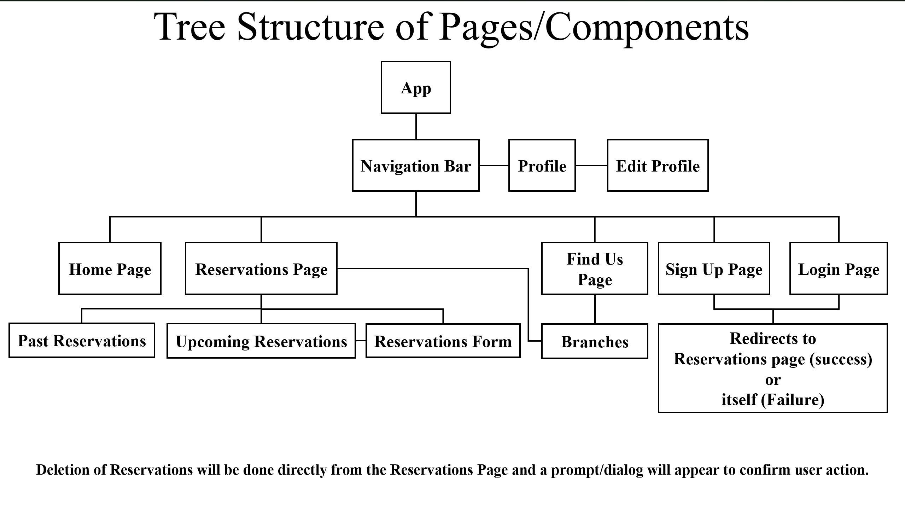

## Project Wireframes

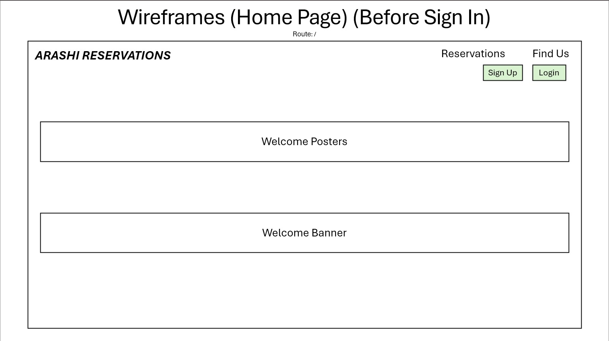

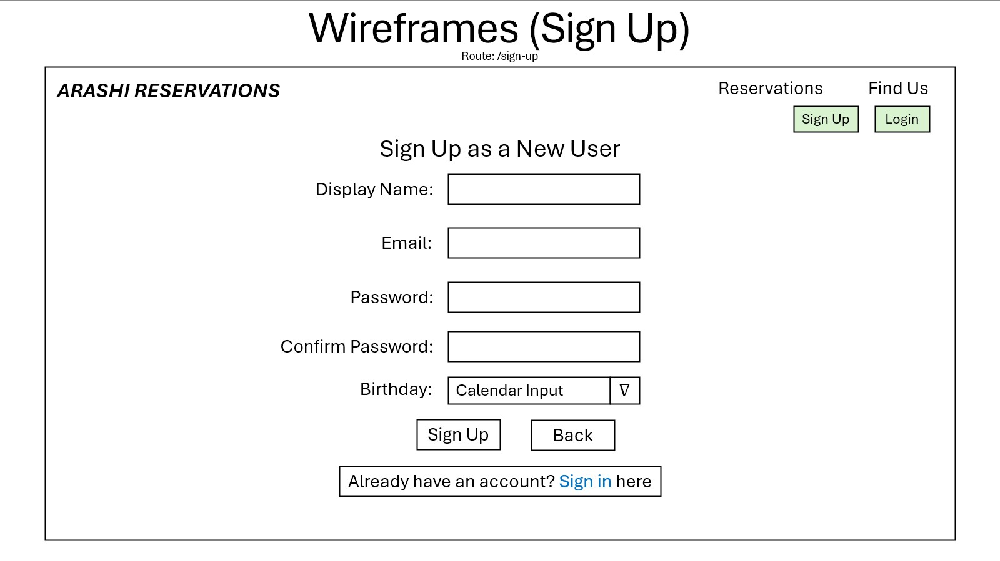

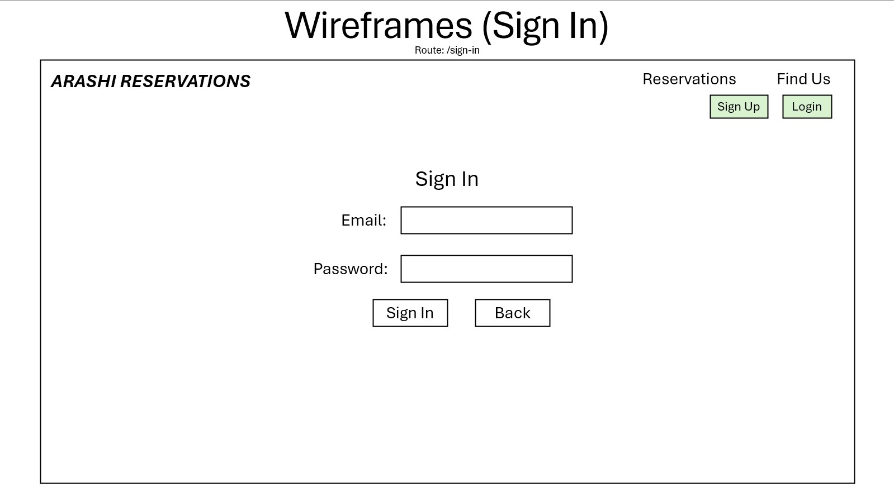

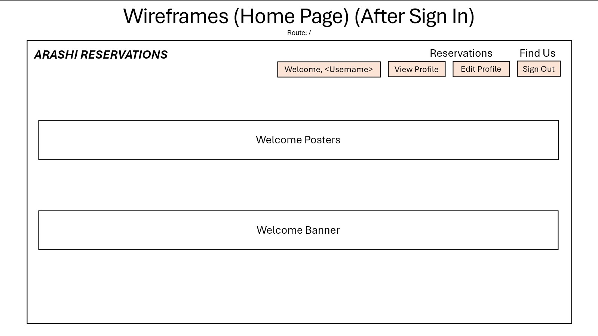

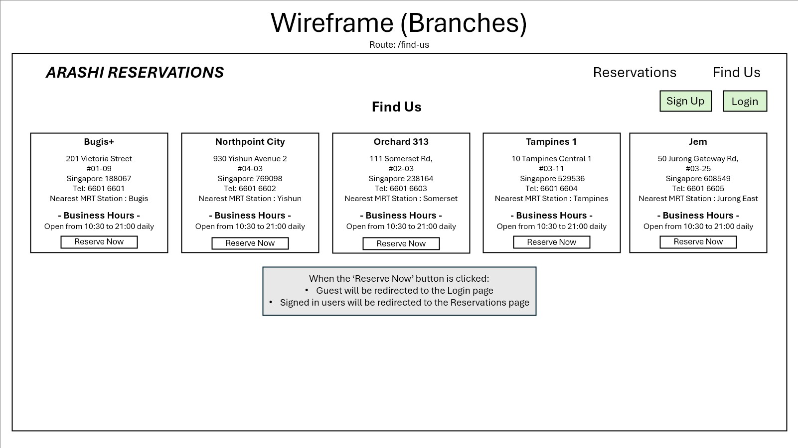

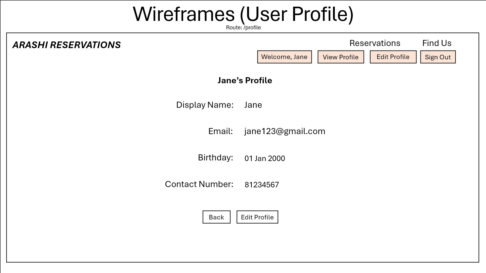

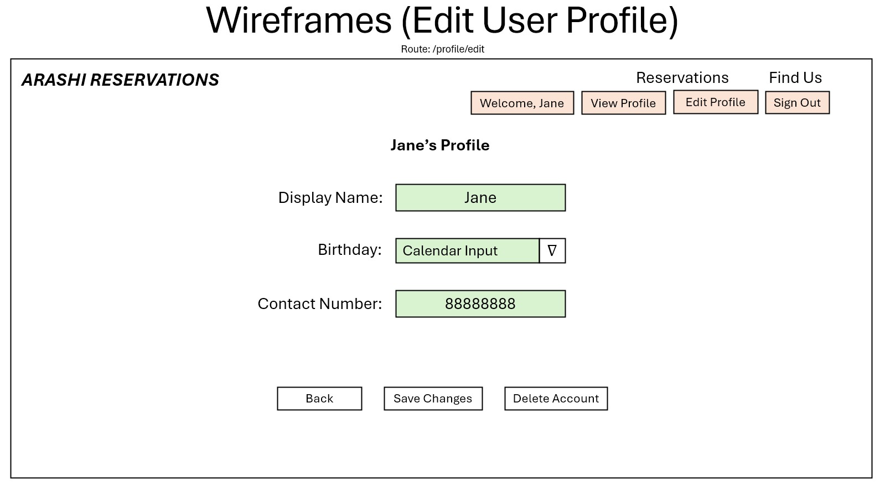

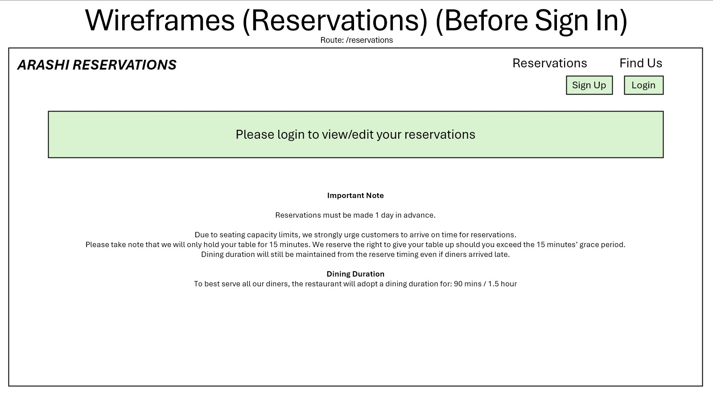

.jpg)

.jpg)

.jpg)

.jpg)

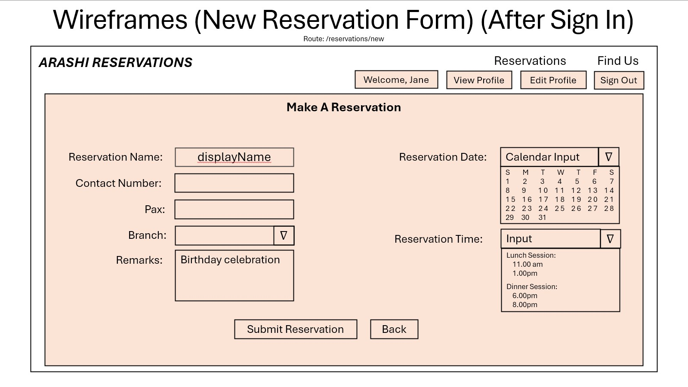

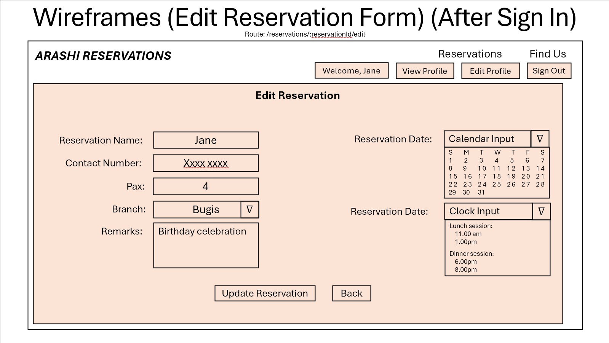

## References:

### Mongoose JS References:
- https://mongoosejs.com/docs/populate.html
- https://mongoosejs.com/docs/api/query.html#Query.prototype.sort()
- https://mongoosejs.com/docs/validation.html
- https://www.geeksforgeeks.org/mongoose-findbyidandupdate-function/
- https://stackoverflow.com/questions/18022365/mongoose-validate-email-syntax

### Date Validation References:
- https://www.google.com/search?q=how+to+get+tomorrow+date+by+using+new+date()&rlz=1C1CHBF_en-GBSG1158SG1158&oq=how+to+get+tomorrow+date+by+using+new+date()&gs_lcrp=EgZjaHJvbWUyCQgAEEUYORigATIHCAEQIRigATIHCAIQIRigATIHCAMQIRigATIHCAQQIRifBTIHCAUQIRifBTIHCAYQIRifBTIHCAcQIRifBdIBCDg3MThqMGo3qAIIsAIB8QVxdWkIFynbtfEFcXVpCBcp27U&sourceid=chrome&ie=UTF-8
- https://www.google.com/search?q=how+to+convert+Tue+Jul+01+2025+11%3A21%3A50+GMT%2B0800+to+YYYY-MM-DD+in+js&sca_esv=7fc33b6cf946bf12&rlz=1C1CHBF_en-GBSG1158SG1158&ei=6AJiaLG1ONLA4-EP26GpoAw&ved=0ahUKEwixyZrHmJiOAxVS4DgGHdtQCsQQ4dUDCBA&uact=5&oq=how+to+convert+Tue+Jul+01+2025+11%3A21%3A50+GMT%2B0800+to+YYYY-MM-DD+in+js&gs_lp=Egxnd3Mtd2l6LXNlcnAiRGhvdyB0byBjb252ZXJ0IFR1ZSBKdWwgMDEgMjAyNSAxMToyMTo1MCBHTVQrMDgwMCB0byBZWVlZLU1NLUREIGluIGpzMggQABiABBiiBDIIEAAYgAQYogQyCBAAGKIEGIkFMggQABiABBiiBEjpN1DRAli9NnABeAGQAQCYAbgBoAGWA6oBAzEuMrgBA8gBAPgBAfgBApgCBKACsAPCAgoQABiwAxjWBBhHwgIGEAAYFhgemAMAiAYBkAYIkgcDMi4yoAfQELIHAzEuMrgHqAPCBwUyLTMuMcgHFQ&sclient=gws-wiz-serp

### Bulma CSS References:
- https://bulma.io/documentation/ (Inclusive of ALL components used under Bulma CSS)
